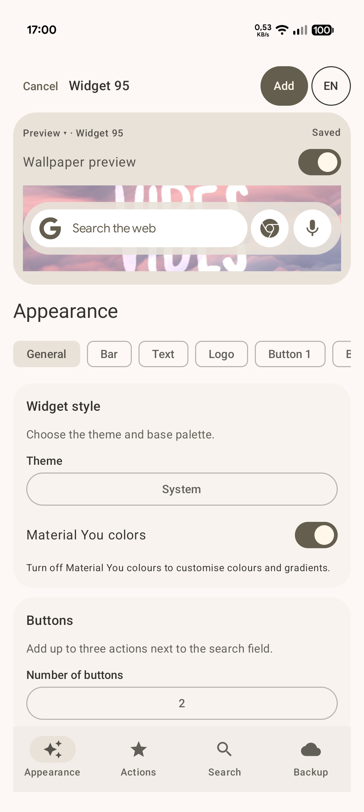
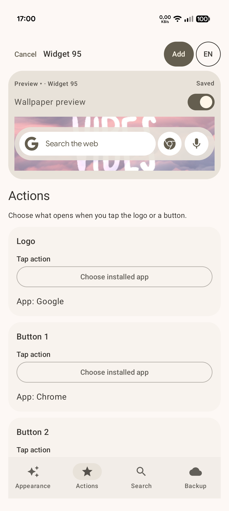
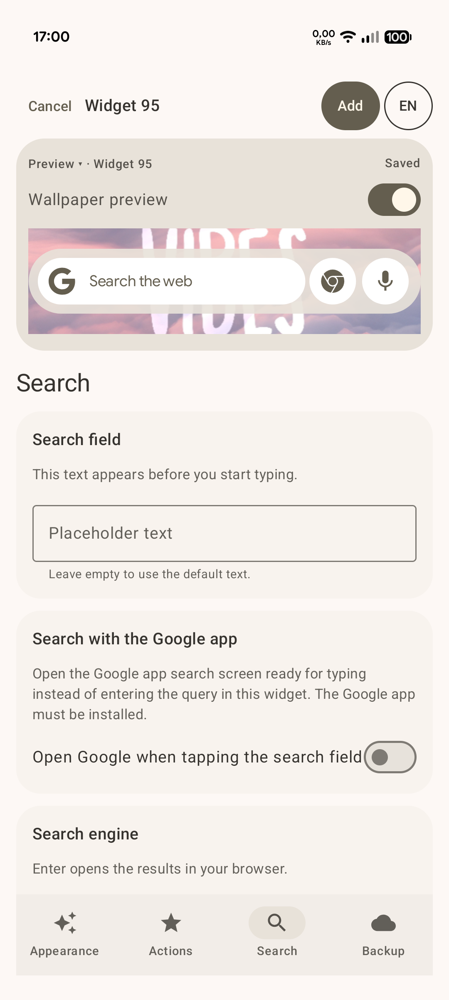
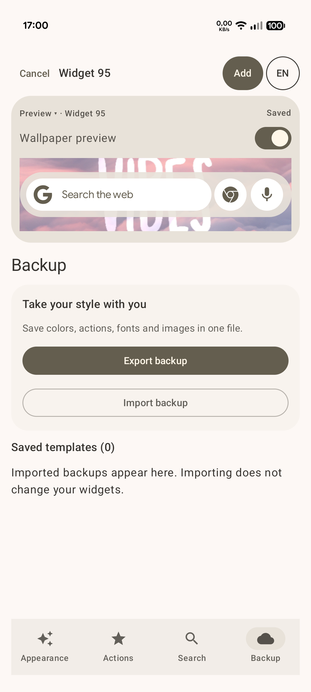

# MySearchWidget

**A customizable Android search widget with Material You colors, gradients, rich text and shortcuts to your apps.**

**English** · [Italiano](README.it.md)

Inspired by the appearance of the **Google Circle to Search** bar, MySearchWidget lets you create independent widgets and configure them through a **Material 3 Expressive** interface with a live preview.


## Screenshots

| Appearance | Actions |
| :---: | :---: |
| [](assets/screenshots/appearance.png) | [](assets/screenshots/actions.png) |

| Search | Backup |
| :---: | :---: |
| [](assets/screenshots/search.png) | [](assets/screenshots/backup.png) |

*Select a screenshot to view it at full resolution.*

## Features

### Search and actions

- Type your query in the widget and send it to your default browser using your chosen search engine.
- Alternatively, tap the search field to open search in the Google app.
- Choose a built-in search engine or add custom engines.
- Assign actions to the left logo and **0, 1, 2 or 3 buttons** on the right: built-in actions, app launches or shortcuts grouped by app.
- Add multiple widgets to your home screen, each with its own appearance and actions.

### Appearance

- **Material You:** use the system’s dynamic color palette.
- **Custom colors and gradients:** customize the outer capsule, search field, logo, each button background and its icon, with separate values for light and dark themes.
- Choose colors with a graphical picker, sliders, HEX/RGB codes and presets. Gradients have two colors and a direction adjustable visually or in degrees.
- Adjust background opacity and corner rounding. Button shapes include circle/square, squircle and flower.
- Choose built-in icons or import images. Each logo/button has a **Monochrome icon** switch, enabled by default. Turn it off to preserve imported image colors and transparency, or use the native colors of the Google and Chrome symbols. Material symbols are naturally single-color.
- Original icon colors take precedence over Material You for that icon only. Manual tint and gradient controls are disabled while original colors are active; saved values return when you switch back to monochrome.
- Preview the widget on a solid background or a center crop of your home screen wallpaper.

### Text

- Customize the **placeholder**, the text displayed before typing: font, size, weight, bold, italic, underline, strikethrough, colors and gradients.
- Format the entire placeholder or a selected range of text.
- Configure the query style separately: it applies to all typed text.
- Use the visual editor or **BBCode** mode.
- The bundled font is **Google Sans Regular 14.000**, licensed under [SIL OFL 1.1](LICENSE-Google-Sans.txt); additional TTF, TTC and OTF fonts can be imported.

### Configuration and backup

- Four sections: **Appearance, Actions, Search and Backup**.
- English and Italian interfaces, with instant switching through **EN / IT** in the top-right corner and a persistent language preference.
- Export and import individual widget configurations, including imported fonts and images.
- A library of reusable templates. Backups are validated before import; applying one to a widget is a separate step that requires confirmation.

## Download

Download the APK and its corresponding source archive from [Releases](https://github.com/alessio89g/MySearchWidget/releases). Each release also includes SHA-256 checksums.

To build the project, see the [build instructions](docs/BUILD.md). Check results and their scope are documented in the [validation notes](docs/TESTING.md).

## Requirements and getting started

- **Android 12 or later** and a launcher that supports widgets.
- A browser for web searches; the Google app for features that require it.

1. Install the MySearchWidget APK, allowing installation from that source if Android requests it.
2. Open the app and choose **Add widget**, or use your launcher’s widget picker.
3. Select the widget instance to configure, customize it and tap **Save**.
4. Tap the search field to start searching, or use the logo and buttons for their assigned actions.

The initial language is **English**. Tap **EN** to switch to Italian. The automatic placeholder is **“Search the web” / “Cerca sul web”**; custom text is not translated automatically.

> The currently produced APK is signed with a **debug key**. Updating an existing installation requires a compatible signature.

## Initial settings and disabled controls

| Option | Default for a new widget | Behavior |
| --- | --- | --- |
| Material You colors | On | Manual color and gradient controls are greyed out and disabled. Turn this option off to customize them. |
| Open Google search when tapping the field | Off | When enabled, search engine management is greyed out and disabled because the Google app handles the search. |

**Your custom settings and saved search engines are not deleted.** They become available again when you turn off the corresponding option. Updates preserve previously saved preferences.

Google search opens its search interface; focus and keyboard behavior depend on the installed Google app version and require device testing. The widget’s query styles do not change Google’s interface.

## Original icon colors — new in 1.7.0

1. Open **Appearance → Logo** or **Appearance → Button N → Icon**.
2. Turn off **Monochrome icon** to use the selected element’s original colors.
3. Tap **Save** to apply the change to the widget.

The switch defaults to on, including when loading older configurations or backups.
Each element keeps its own setting. Original colors bypass saved tint, gradient
and tint opacity while retaining the image’s own transparency. Material symbols
normally have a black source fill: keep monochrome enabled to adapt them to the
theme’s contrast.

The setting is included in backups. To import a backup exported by 1.7.0, update
the app on the receiving device too. Older backups remain importable.

See the [changelog](CHANGELOG.md) and download [release 1.7.0](https://github.com/alessio89g/MySearchWidget/releases/tag/v1.7.0).

## App shortcuts

The picker groups shortcuts by app and excludes apps without available entries. Some actions may be visible but disabled, with an explanation.

To access dynamic shortcuts published by apps:

1. In **Actions**, choose **Enable temporary access** and temporarily set MySearchWidget as your Home app.
2. Return to configuration, select **Shortcuts → app → action** and save.
3. Use **Restore your launcher** to switch back to your usual launcher.

This temporarily changes the actual default launcher; a recovery screen provides access to Home settings. Pinned shortcuts can still launch after restoring your previous launcher.

Availability depends on the shortcuts other apps actually publish and enable. After reinstalling or moving to another phone, dynamic shortcuts need to be selected and pinned again.

## Wallpaper and permissions

Wallpaper preview is optional. Reading the home screen wallpaper may require image access and, on some systems, special all-files access: the app offers this separately with an explanation.

If access is denied or the wallpaper cannot be read, for example with a live wallpaper, the preview keeps its solid background. The app does not scan your gallery or include the wallpaper in backups.

MySearchWidget does not request **Internet, microphone or draw-over-other-apps permissions**. Online searches and voice actions are handled by the selected external apps.

## BBCode examples

A placeholder with partial formatting:

```text
[b]Search[/b] [gradient=#00C8FF,#00D99B,45]the web[/gradient]
```

A global query style:

```text
[b][i]{query}[/i][/b]
```

Available tags also include `[u]`, `[s]`, `[size=20]`, `[weight=500]`, `[font=default]` and `[color=#FF0000]`, with their corresponding closing tags. For queries, `{query}` must appear exactly once and have a single style. After editing, tap **Apply BBCode**. Custom colors require Material You to be turned off.

## Compatibility and limitations

- Widget size and placement also depend on your launcher’s grid and resizing behavior.
- Google actions and app shortcuts depend on installed apps and their versions. Not every destination has been tested on a physical device.
- Background blur is not available.
- This is an independent project and is not affiliated with Google. Its visual inspiration does not imply support for Circle to Search.

## License and credits

The project's original code is distributed under the **MySearchWidget Non-Commercial Source-Available License 1.1**, a custom license. The complete, governing English text is available in [LICENSE](LICENSE).

- **Allowed:** non-commercial use, study, copying, modification, forks and non-commercial redistribution.
- **Prohibited:** commercial use, sale and exploitation of the software in commercial products or services, including advertising monetization.
- **Unmodified versions:** no source delivery is required; a link to the [original repository](https://github.com/alessio89g/MySearchWidget) in the credits is sufficient.
- **Modified versions:** redistribution must include the complete corresponding source code, including modifications and build instructions and scripts. A repository link alone is not sufficient.
- **Required credits:** both modified and unmodified redistributions must cite MySearchWidget and link to the original repository in their credits. See [CREDITS.md](CREDITS.md).
- **Same terms:** modified versions must retain this license, attribution notices and a description of changes. Modifications kept private do not need to be published.

The project is **source available for non-commercial use**, not open source under the [OSI definition](https://opensource.org/osd), which does not allow restrictions on commercial use.

Third-party assets are excluded from this license and retain their own terms: Material icons are distributed under [Apache 2.0](LICENSE-Material-Icons.txt); Google Sans is distributed under [SIL OFL 1.1](LICENSE-Google-Sans.txt). Trademarks and other third-party assets are not relicensed by this project.
